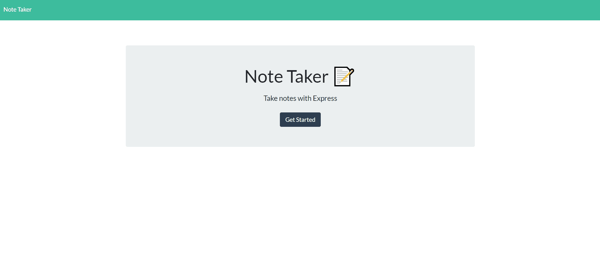

# Week 11 - University of Adelaide Coding Boot Camp

## Express.js: Note Taker

<br/>

## Description

The application is called Note Taker, it can be userd to write and save notes. This application will use an Express.js back-end and will save and retrieve note data from a JSON file.

## Installation

You will need to clone the repository from GitHub, download and install Node.
This app will require some module to work, you can install them using

```
npm i
```

## Usage

Use this command to start

```
node server.js
```

## Application demo



<br/>

© Carl Santiago\
📧 4518gg@gmail.com
